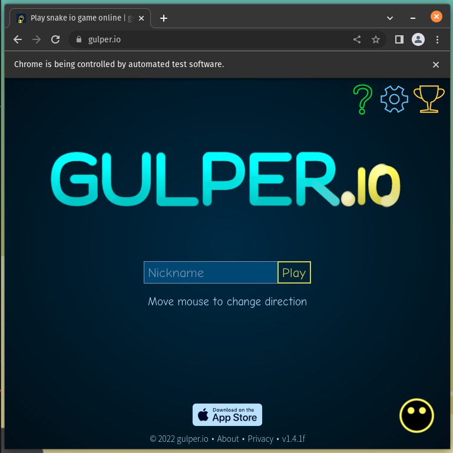
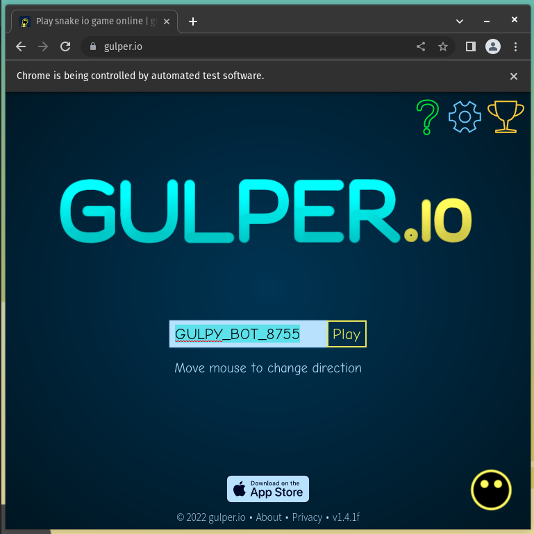
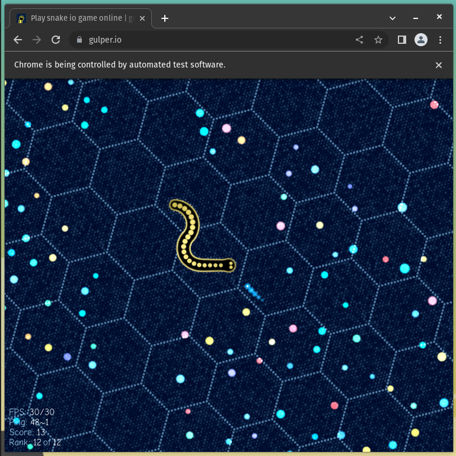
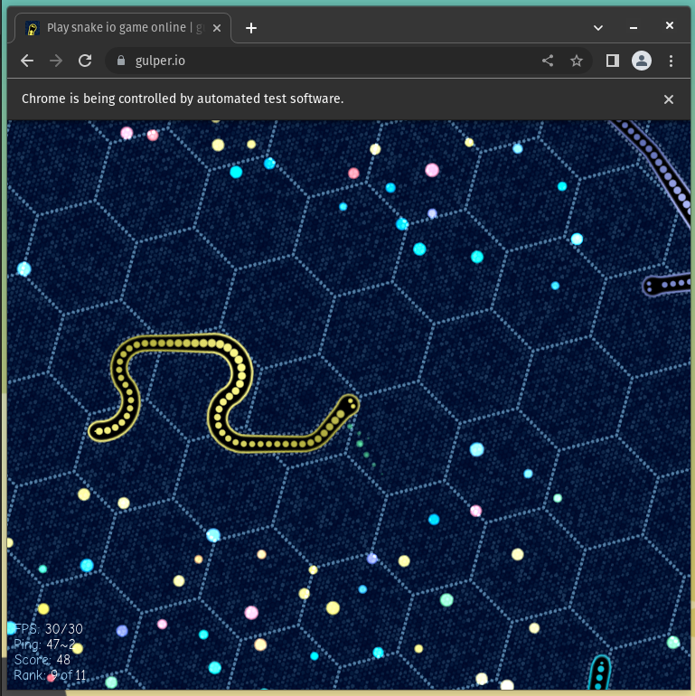

# Gulpy the Gulper.io Bot

**Gulpy** is a bot for [Gulper.io](https://gulper.io) that is designed to be a simple, easy-to-use, and easy-to-extend bot. It is written in Python and uses Selenium to interact with the Gulper.io website.

## Installation

**Gulpy** requires Python 3 or higher and [ChromeDriver](https://chromedriver.chromium.org/downloads). It also requires the following Python packages:

  * [selenium](https://pypi.org/project/selenium/)

Start by installing the dependencies:

```bash
pip install -r requirements.txt
```

Then, download the appropriate version of [ChromeDriver](https://chromedriver.chromium.org/downloads) based on your system's Chrome Browser version and place it in the same directory as **Gulpy**.

## Usage

**Gulpy** is designed to be run from the command line. It can be run with the following command:

```bash
python gulpy.py
```

## Gulpy the Gulper.io Bot in Action


<table width="100%">
  <tr>
    <td width="50%"></td>
    <td width="50%"></td>
  </tr>
  <tr>
    <td width="50%"></td>
    <td width="50%"></td>
  </tr>
</table>


### Disclaimer

This bot is not affiliated with Gulper.io in any way. It is designed to be used for educational purposes only. The very purpose of this bot is to demonstrate how to use Selenium to interact with a website. Use at your own risk. I am not responsible for any bans or other issues that may arise from using this bot.

### License

This project is licensed under the MIT License - see the [LICENSE](LICENSE) file for details.
